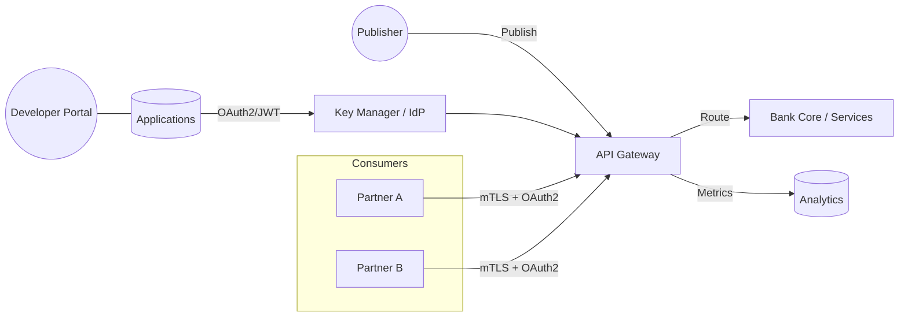

# Architecture (Mermaid)

```mermaid
flowchart LR
    DevPortal((Developer Portal)) --- Apps[(Applications)]
    Publisher((Publisher)) -->|Publish| GW[API Gateway]
    KM[Key Manager / IdP] --> GW
    GW -->|Route| Core[Bank Core / Services]
    GW -->|Metrics| Analytics[(Analytics)]
    Apps -->|OAuth2/JWT| KM
    subgraph Consumers
      PartnerA[Partner A]
      PartnerB[Partner B]
    end
    PartnerA -->|mTLS + OAuth2| GW
    PartnerB -->|mTLS + OAuth2| GW
```
